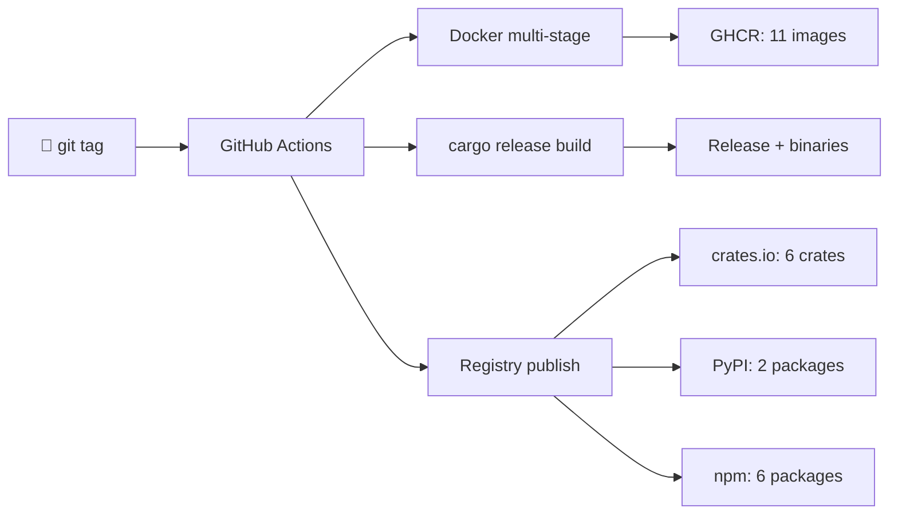

<div align="center">

[](https://github.com/BartoszOsiej)

[](https://bartoszosiej.github.io/Portfolio/)
[](mailto:mmc29213@gmail.com)
[](https://linkedin.com/in/bartosz-osiej)

</div>

> [!IMPORTANT]
> **19 y/o · Poland · open to first paid role** — remote/hybrid, junior systems/backend.
> Everything below is *deployed infrastructure*, not tutorials: 15 repositories, every one with CI/CD, releases with binaries, Docker images and published packages.

---

## ⚙️ Stack

<div align="center">

[](https://www.rust-lang.org/)
[](https://aya-rs.dev/)
[](https://www.python.org/)
[](https://www.typescriptlang.org/)
[](https://fastapi.tiangolo.com/)
[](https://wgpu.rs/)
[](https://github.com/features/packages)
[](https://github.com/features/actions)

</div>

---

## 🚀 Flagship Projects

<table>
<tr><td valign="top" width="50%">

### 🔬 [halcyon-process-monitor](https://github.com/BartoszOsiej/halcyon-process-monitor)

eBPF ransomware behavior tracker — kernel-level `execve`/`openat` tracing through Aya, per-CPU perf buffers, sliding-window alerting, full ratatui TUI.

`Rust` `Aya` `ratatui` `eBPF`

[](https://crates.io/crates/process-monitor) [](https://github.com/BartoszOsiej/halcyon-process-monitor/pkgs/container/halcyon-process-monitor) [](https://github.com/BartoszOsiej/halcyon-process-monitor/releases)

</td><td valign="top" width="50%">

### 🎮 [NV2_ENGINE](https://github.com/BartoszOsiej/NV2_ENGINE)

Voxel game engine with MLP neural renderer, multiplayer over TCP, Epic Games Store integration. Published as a crate.

`Rust` `wgpu` `MLP` `TCP`

[](https://crates.io/crates/nv2_engine) [](https://github.com/BartoszOsiej/NV2_ENGINE/pkgs/container/nv2_engine) [](https://github.com/BartoszOsiej/NV2_ENGINE/releases)

</td></tr>
<tr><td valign="top" width="50%">

### ⚡ [externum](https://github.com/BartoszOsiej/externum)

Programming language built from scratch — compiles to Python, Bash and native binary. Ownership, traits, macros. 192-test suite, on PyPI since v2.

**▶ [Run it in your browser — and extend the language live](https://bartoszosiej.github.io/externum/)**

`Python` `Compiler design` `PyPI`

[](https://pypi.org/project/externum/) [](https://github.com/BartoszOsiej/externum/pkgs/container/externum) [](https://bartoszosiej.github.io/externum/)

</td><td valign="top" width="50%">

### 🔒 [cybersec-tools](https://github.com/BartoszOsiej/cybersec-tools)

Four security tools as one workspace — port scanner, web scanner, hash cracker, packet analyzer. Each shipped separately on crates.io.

`Rust` `Tokio` `libpcap`

[](https://crates.io/crates/netrecon) [](https://crates.io/crates/shadowscan) [](https://crates.io/crates/hashsleuth) [](https://crates.io/crates/packeteye)

</td></tr>
<tr><td valign="top" width="50%">

### 🛡️ [pqguard](https://github.com/BartoszOsiej/pqguard)

Post-quantum file encryption CLI — ML-KEM-768 key exchange + AES-256-GCM + HKDF. NIST FIPS 203 compliant, fuzz-tested.

**▶ [Landing page](https://bartoszosiej.github.io/pqguard/)**

`Rust` `Cryptography` `NIST`

[](https://crates.io/crates/pqguard) [](https://github.com/BartoszOsiej/pqguard/actions) [](https://github.com/BartoszOsiej/pqguard/pkgs/container/pqguard)

</td><td valign="top" width="50%">

### 🧬 [Docs](https://bartoszosiej.github.io/Docs/)

Technical documentation site — architecture guides, API reference, deployment playbooks.

`TypeScript` `Deploy` `GitHub Pages`

[](https://www.npmjs.com/package/bartosz-osiej-docs) [](https://bartoszosiej.github.io/Docs/)

</td></tr>
</table>

<details>
<summary><b>📦 More projects (click to expand)</b></summary>

| | Project | What it is | Try it |
|---|---------|-----------|--------|
| ◈ | [**AURORA-OS**](https://github.com/BartoszOsiej/AURORA-OS) | Complete OS in the browser — kernel, window manager, filesystem, 8 apps, procedural audio | [npm](https://www.npmjs.com/package/aurora-os) |
| 🌐 | [**n2-mesh**](https://github.com/BartoszOsiej/n2-mesh) | Serverless P2P chat — WebRTC + MQTT signaling, zero dependencies | [npm](https://www.npmjs.com/package/n2-mesh) |
| 🔗 | [**FastAPI-url**](https://github.com/BartoszOsiej/FastAPI-url) | URL shortener — JWT auth, click tracking, React dashboard | [PyPI](https://pypi.org/project/fastapi-url/) |
| 🎯 | [**prompt-inbox**](https://github.com/BartoszOsiej/prompt-inbox) | Remote prompt inbox for AI agents — mobile-first, zero backend | [npm](https://www.npmjs.com/package/prompt-inbox) |
| 🎮 | [**novactorio**](https://github.com/BartoszOsiej/Factorio-web-game) | Factorio-style factory builder fully playable in browser | [npm](https://www.npmjs.com/package/novactorio) |
| 📚 | [**teleinformatyka-wikipedia**](https://github.com/BartoszOsiej/teleinformatyka-wikipedia) | PL/EN telecom encyclopedia — networking, 5G, fiber, security | [docs](https://bartoszosiej.github.io/Docs/) |

</details>

---

## 📦 Distribution — everything ships, nothing rots



<div align="center">

| 🐳 GHCR images | 🦀 crates.io | 🐍 PyPI | 🟢 npm | 📋 Repos with CI/CD |
|:--------------:|:------------:|:-------:|:------:|:----------------------:|
| **13** | **8** | **2** | **6** | **15 / 15** |

</div>

### 🕹️ Interactive — a recruiter can actually run this

| | |
|---|---|
| **▶ [Externum Playground](https://bartoszosiej.github.io/externum/)** | The programming language running 100% in your browser (Pyodide). Write programs, hot-load your own modules into the live runtime, compile to Python/Bash/binary. Sessions shareable by URL. |
| **🧬 `/define`** | Comment on an issue → the bot validates your module against Externum's type checker → opens a PR into the stdlib → once merged, `import` works for everyone including the web playground. [The language evolves from comments.](https://github.com/BartoszOsiej/externum/issues/7) |
| **🎮 `/run`** | [Comment on cybersec-tools](https://github.com/BartoszOsiej/cybersec-tools/issues/10) → the bot builds the workspace in CI and executes the real binaries with sandboxed guardrails, posting output back. |
| **🔏 `./verify.sh v0.4.5`** | One command verifies SLSA provenance + Sigstore signatures + SBOM of any release. No trust required. |

### ⚡ One-command install — like real CLI tools

```bash
# macOS (Apple Silicon & Intel)
brew tap bartoszosiej/tap https://github.com/BartoszOsiej/homebrew-tap
brew install bartoszosiej/tap/netrecon bartoszosiej/tap/hashsleuth

# Windows
scoop bucket add bartoszosiej https://github.com/BartoszOsiej/scoop-bucket
scoop install netrecon hashsleuth
```

*Formulas & manifests are re-synced hourly by a bot with fresh SHA-256 sums — never stale.*

### 🖥️ Build matrix — 5 platforms per release

<div align="center">

| Linux x86_64 | Linux arm64 | macOS arm64 | macOS x86_64 | Windows x64 |
|:------------:|:-----------:|:-----------:|:------------:|:-----------:|
| ✅ | ✅ | ✅ | ✅ | ✅ |

</div>

---

## 🔐 Signed supply chain

*The same pipeline discipline big tech uses — cryptographically verifiable, not "trust me".*

<div align="center">

[](https://scorecard.dev/viewer/?uri=github.com/BartoszOsiej/cybersec-tools)
[](https://scorecard.dev/viewer/?uri=github.com/BartoszOsiej/halcyon-process-monitor)
[](https://scorecard.dev/viewer/?uri=github.com/BartoszOsiej/NV2_ENGINE)
[](https://scorecard.dev/viewer/?uri=github.com/BartoszOsiej/externum)
[](https://scorecard.dev/viewer/?uri=github.com/BartoszOsiej/FastAPI-url)

</div>

| Layer | What it means |
|---|---|
| **cosign keyless signing** | Every GHCR image is signed via Sigstore/Fulcio OIDC — no keys to leak, identity bound to the GitHub workflow |
| **SLSA v1 provenance** | Every release binary carries a build attestation proving *which commit, which runner, which pipeline* produced it |
| **SPDX SBOM** | Every release ships a machine-readable software bill of materials |
| **OpenSSF Scorecard** | Automated supply-chain security grading on 5 production repos |

Verify it yourself — no trust required:

```bash
# verify a container image signature
cosign verify ghcr.io/bartoszosiej/cybersec-tools \
  --certificate-identity-regexp "^https://github.com/BartoszOsiej/" \
  --certificate-oidc-issuer https://token.actions.githubusercontent.com

# verify binary build provenance
gh attestation verify netrecon-x86_64-unknown-linux-gnu \
  -R BartoszOsiej/cybersec-tools
```

---

<details>
<summary><b>🗂️ Full package index</b></summary>

**npm**
[](https://www.npmjs.com/package/aurora-os)
[](https://www.npmjs.com/package/n2-mesh)
[](https://www.npmjs.com/package/novactorio)
[](https://www.npmjs.com/package/prompt-inbox)
[](https://www.npmjs.com/package/bartosz-osiej-docs)
[](https://www.npmjs.com/package/bartosz-osiej-portfolio)

**crates.io**
[](https://crates.io/crates/process-monitor)
[](https://crates.io/crates/pqguard)
[](https://crates.io/crates/nv2_engine)
[](https://crates.io/crates/netrecon)
[](https://crates.io/crates/shadowscan)
[](https://crates.io/crates/hashsleuth)
[](https://crates.io/crates/packeteye)

**PyPI**
[](https://pypi.org/project/externum/)
[](https://pypi.org/project/fastapi-url/)

</details>

---

## 🛡️ Engineering discipline

> [!NOTE]
> Every repository runs the same production-grade pipeline — this is how I work, not how I pretend to work.

| Practice | Coverage |
|----------|:--------:|
| CodeQL security scanning | ✅ 15/15 |
| Dependabot + vulnerability alerts | ✅ 15/15 |
| Branch protection + squash-merge history | ✅ 15/15 |
| Public sprint boards + milestones | ✅ 6 boards |
| Discussions, CONTRIBUTING, SECURITY, CoC | ✅ 15/15 |
| MIT licensing, topics, descriptions | ✅ 15/15 |

---

## 📊 Live Package Metrics

*Self-hosted stats engine — a scheduled workflow queries npm / PyPI / crates.io /
GitHub releases and renders these cards from scratch. No badge services, no
third-party renderers: every pixel comes from my own pipeline.*

<picture>
  <source media="(prefers-color-scheme: dark)" srcset="https://raw.githubusercontent.com/BartoszOsiej/BartoszOsiej/stats/svg/metrics-dark.svg" />
  
</picture>

---

## 📈 GitHub Stats

<picture>
  <source media="(prefers-color-scheme: dark)" srcset="https://github-readme-stats-eight-theta.vercel.app/api?username=BartoszOsiej&show_icons=true&hide_border=true&bg_color=0d1117&title_color=58a6ff&icon_color=1f6feb&text_color=c9d1d9&count_private=true" />
  <source media="(prefers-color-scheme: light)" srcset="https://github-readme-stats-eight-theta.vercel.app/api?username=BartoszOsiej&show_icons=true&hide_border=true&bg_color=f6f8fa&title_color=0969da&icon_color=0969da&text_color=24292f&count_private=true" />
  
</picture>
<picture>
  <source media="(prefers-color-scheme: dark)" srcset="https://github-readme-stats-eight-theta.vercel.app/api/top-langs/?username=BartoszOsiej&layout=compact&hide_border=true&bg_color=0d1117&title_color=58a6ff&text_color=c9d1d9&langs_count=8" />
  <source media="(prefers-color-scheme: light)" srcset="https://github-readme-stats-eight-theta.vercel.app/api/top-langs/?username=BartoszOsiej&layout=compact&hide_border=true&bg_color=f6f8fa&title_color=0969da&text_color=24292f&langs_count=8" />
  
</picture>
<br/>
<picture>
  <source media="(prefers-color-scheme: dark)" srcset="https://streak-stats.demolab.com/?user=BartoszOsiej&hide_border=true&background=0d1117&ring=58a6ff&fire=F0883E&currStreakLabel=58a6ff" />
  <source media="(prefers-color-scheme: light)" srcset="https://streak-stats.demolab.com/?user=BartoszOsiej&hide_border=true&background=f6f8fa&ring=0969da&fire=D4A017&currStreakLabel=0969da" />
  
</picture>

<picture>
  <source media="(prefers-color-scheme: dark)" srcset="https://github-readme-activity-graph.vercel.app/graph?username=BartoszOsiej&theme=tokyo-night&hide_border=true&bg_color=0d1117&color=c9d1d9&line=58a6ff&point=F0883E" />
  <source media="(prefers-color-scheme: light)" srcset="https://github-readme-activity-graph.vercel.app/graph?username=BartoszOsiej&theme=minimal&hide_border=true&bg_color=f6f8fa&color=24292f&line=0969da&point=D4A017" />
  
</picture>

---

## 🗺️ Timeline

```
2021 ──► first lines of code — Java, CryEngine, Minecraft mechanics
2025 ──► networking & security track (teleinformatyka)
2026 Q1 ──► Rust deep dive: voxel engine, eBPF kernel probes, compiler from scratch
2026 Q3 ──► production CI/CD: Actions → GHCR → crates.io / PyPI / npm, 14 packages live
2026 Q4 ──► shipping: teleinformatyka-wikipedia, NV2 multiplayer, first paid role 🎯
```

---

## 🌐 Also here

- **[`ghost0development`](https://github.com/ghost0development)** — archive account since 2021 (31 repos); canonical `halcyon-process-monitor` lives there

---

<picture>
  <source media="(prefers-color-scheme: dark)" srcset="https://raw.githubusercontent.com/BartoszOsiej/BartoszOsiej/output/github-contribution-grid-snake-dark.svg" />
  <source media="(prefers-color-scheme: light)" srcset="https://raw.githubusercontent.com/BartoszOsiej/BartoszOsiej/output/github-contribution-grid-snake.svg" />
  
</picture>

---


<div align="center">

<picture>
  <source media="(prefers-color-scheme: dark)" srcset="https://raw.githubusercontent.com/BartoszOsiej/BartoszOsiej/stats/svg/views-dark.svg">
  
</picture>

*Open to work — [`mmc29213@gmail.com`](mailto:mmc29213@gmail.com)*

</div>
